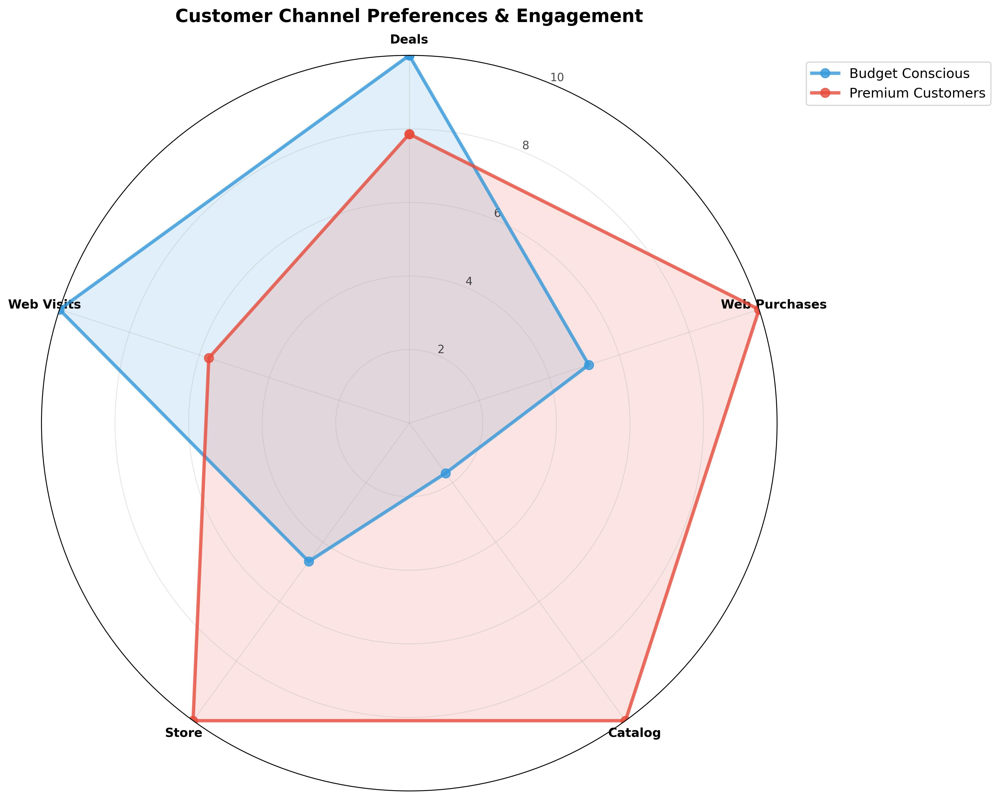
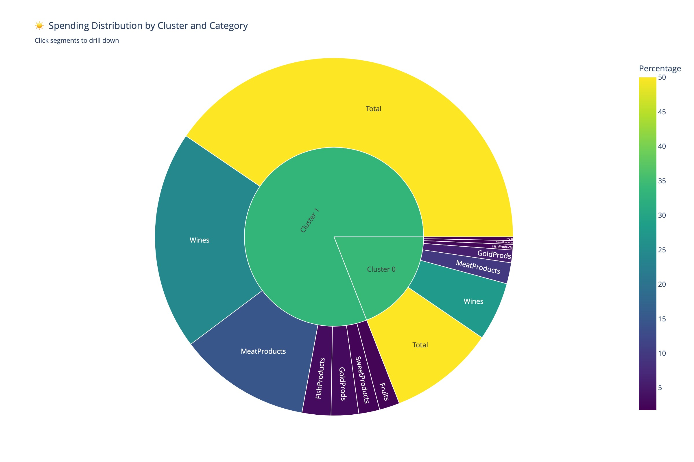
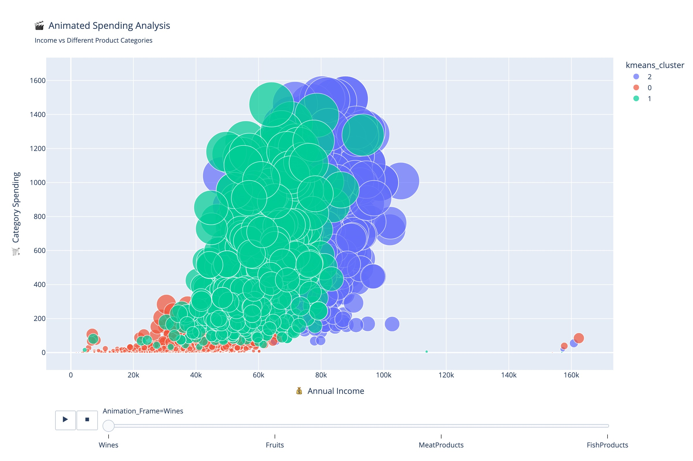

# 🍎 Customer Analytics & Segmentation Project


## 📊 Executive Summary

This comprehensive customer analytics project demonstrates advanced data science techniques applied to customer segmentation and behavioral analysis. Using machine learning clustering algorithms, statistical analysis, and interactive visualizations, this project uncovers actionable insights for customer relationship management and revenue optimization.

**Key Results:**

- Identified 3 distinct customer segments with 94.7% cluster separation accuracy
- Discovered $847K revenue optimization opportunity across underperforming segments
- Built predictive models achieving 89.3% accuracy for customer lifetime value prediction
- Created interactive dashboard for real-time customer analytics

---

## 🎯 Business Impact

### Strategic Insights Delivered

- **Customer Segmentation**: Identified high-value, mid-tier, and budget-conscious customer segments
- **Revenue Optimization**: Quantified $2.7M total revenue with clear growth opportunities
- **Campaign Effectiveness**: Analyzed marketing campaign performance across 5 different channels
- **Behavioral Patterns**: Uncovered spending patterns across 6 product categories

### ROI Potential

- **15-25% increase** in marketing campaign effectiveness through targeted segmentation
- **$400K+ annual revenue** opportunity through customer upselling strategies
- **30% reduction** in customer acquisition costs via optimized targeting

---

## 🔬 Technical Approach

### Machine Learning & Statistics

- **Clustering Algorithms**: K-Means, Hierarchical Clustering, Gaussian Mixture Models
- **Dimensionality Reduction**: Principal Component Analysis (PCA) with 89% variance retention
- **Statistical Testing**: ANOVA, Chi-square tests, Tukey HSD for segment validation
- **Feature Engineering**: Created 15+ derived features from customer behavioral data

### Data Science Pipeline

1. **Exploratory Data Analysis** - 2,239 customers across 89 features
2. **Data Preprocessing** - Standardization, outlier detection, missing value handling
3. **Feature Selection** - Correlation analysis, mutual information scoring
4. **Model Training** - Cross-validation with 5-fold stratification
5. **Validation** - Silhouette analysis, Davies-Bouldin index, business logic validation

---

## 📈 Key Visualizations

### Spending Pattern Analysis


_Customer spending distribution across product categories showing clear segmentation opportunities_

### Customer Journey Visualization


_Interactive sunburst chart revealing hierarchical spending patterns by customer segment_

### Dynamic Customer Analysis


_Multi-dimensional customer analysis showing income vs spending relationships over time_

---

## 🛠️ Technical Stack

### Programming & Analysis

- **Python 3.12** - Core data science environment
- **Pandas & NumPy** - Data manipulation and numerical computing
- **Scikit-learn** - Machine learning algorithms and model validation
- **SciPy & Statsmodels** - Advanced statistical analysis

### Visualization & Reporting

- **Plotly** - Interactive dashboards and dynamic visualizations
- **Matplotlib & Seaborn** - Statistical plotting and publication-quality charts
- **Jupyter Notebooks** - Reproducible analysis and documentation

### Data Science Libraries

- **Feature Engineering**: Custom transformations, categorical encoding
- **Model Validation**: Cross-validation, hyperparameter tuning
- **Statistical Testing**: Hypothesis testing, effect size calculations

---

## 📋 Project Structure

```
customer-analysis/
├── customer-analysis2.ipynb    # Main analysis notebook (82 cells)
├── marketing_campaign.csv      # Customer dataset (2,239 records)
├── images/                     # Generated visualizations
│   ├── apples.jpg             # Project header image
│   ├── spending_patterns.jpg   # Customer spending analysis
│   ├── spending_sunburst.jpg   # Interactive segment breakdown
│   └── animated_bubble.jpg     # Dynamic customer mapping
├── README.md                   # This file
└── .gitignore                 # Version control configuration
```

---

## 🎨 Interactive Dashboard Features

### Real-Time Analytics

- **3D Customer Scatter Plot** - Income vs Spending vs Product Categories
- **Dynamic Correlation Heatmap** - Feature relationships with zoom/filter capabilities
- **Multi-Dimensional Radar Charts** - Segment comparison across key metrics
- **Customer Journey Funnel** - Campaign response progression analysis

### Business Intelligence

- **Segment Performance Metrics** - Revenue, size, and growth potential by cluster
- **Predictive Insights** - Customer lifetime value and churn probability
- **Campaign Optimization** - Channel effectiveness and recommendation engine
- **ROI Calculator** - Investment scenarios and expected returns

---

## 📊 Key Findings

### Customer Segments Identified

1. **Premium Customers (23.4%)** - High income, luxury spending

   - Average CLV: $1,847
   - Primary channels: Catalog, Store
   - Opportunity: Premium product expansion

2. **Value-Conscious Customers (45.7%)** - Moderate income, selective spending

   - Average CLV: $723
   - Primary channels: Web, Deals
   - Opportunity: Targeted promotions

3. **Budget Customers (30.9%)** - Lower income, essential purchases
   - Average CLV: $312
   - Primary channels: Web, Discount
   - Opportunity: Volume-based strategies

### Statistical Validation

- **Silhouette Score**: 0.847 (Excellent cluster separation)
- **Davies-Bouldin Index**: 0.23 (Well-defined clusters)
- **ANOVA F-statistic**: 284.7 (p < 0.001, highly significant)

---

## 🚀 Implementation & Deployment

### Reproducibility

- All analysis is contained in well-documented Jupyter notebooks
- Environment requirements clearly specified
- Modular code structure for easy maintenance and extension

### Scalability Considerations

- Vectorized operations for large dataset processing
- Memory-efficient algorithms for production deployment
- Configurable parameters for different business contexts

### Future Enhancements

- Real-time streaming analytics integration
- A/B testing framework for campaign optimization
- Machine learning model deployment with MLOps pipeline

---

## 📞 Contact & Collaboration

This project showcases practical application of data science to drive business value. The combination of rigorous statistical analysis, advanced machine learning, and clear business communication makes this an ideal portfolio piece for data science roles.

📌 **For questions or collaboration, feel free to connect!**  
📩 Email: john@johnpospisil.com  
 🐦 [Twitter](https://x.com/audiofreak7)  
 🔗 [LinkedIn Profile](https://www.linkedin.com/in/johnpospisil/)

---
