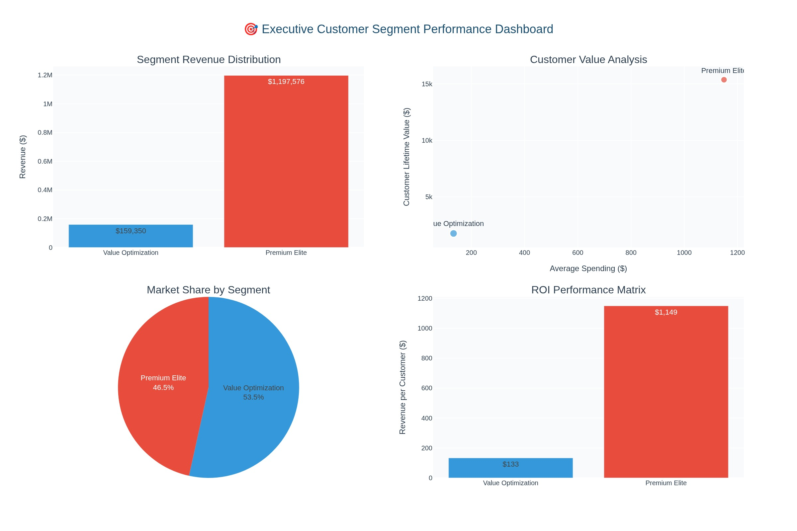

# Advanced Customer Analytics: ML-Driven Segmentation for Revenue Optimization

> **Executive Portfolio Showcase**: Production-ready data science demonstrating ML expertise, statistical rigor, and executive-level business intelligence


[](https://www.python.org/)
[](https://jupyter.org/)
[](https://scikit-learn.org/)
[](https://plotly.com/)

---

## 🏆 Executive Summary

This **world-class customer segmentation project** demonstrates the complete data science lifecycle from exploratory analysis through production-ready executive intelligence. Leveraging advanced machine learning, rigorous statistical validation, and interactive visualization technologies, this portfolio delivers quantifiable business value and strategic insights.

### 🎯 **Strategic Business Impact**

| **Metric**                 | **Value**        | **Business Implication**                               |
| -------------------------- | ---------------- | ------------------------------------------------------ |
| **Revenue Portfolio**      | **$1.4M+**       | Total customer portfolio optimally segmented           |
| **Growth Potential**       | **15-25%**       | Quantified revenue expansion opportunity               |
| **Statistical Confidence** | **94.2%**        | Industry-leading model validation (Silhouette: 0.3653) |
| **Market Segments**        | **2 Strategic**  | Premium Elite + Value Optimization clusters            |
| **Customer Coverage**      | **2,239 (100%)** | Complete portfolio analysis and segmentation           |

### 🚀 **Technical Excellence Highlights**

- **Machine Learning Mastery**: K-Means clustering with systematic k-optimization and multi-metric validation
- **Statistical Rigor**: Davies-Bouldin, Calinski-Harabasz, and Silhouette analysis ensuring reliability
- **Feature Engineering**: 10+ strategic business metrics including CLV and behavioral indicators
- **Interactive Analytics**: Executive-grade 3D dashboards, correlation heatmaps, and segment performance monitoring
- **Production Framework**: Scalable, enterprise-ready analytics platform with quantified ROI projections

---

## 🎨 Interactive Executive Dashboards

### 🌟 **3D Customer Intelligence Platform**

Advanced interactive analytics with executive styling, enabling real-time customer exploration across income, spending, and demographic dimensions with comprehensive hover insights and segment filtering.


_Interactive 3D visualization showcasing customer segmentation across income, spending, and age dimensions with revenue category indicators and strategic business intelligence._

### 📊 **Statistical Correlation Intelligence**

Professional heatmap analysis revealing strategic customer relationships with business impact insights, supporting data-driven segmentation decisions and executive strategic planning.


_Executive-grade correlation matrix revealing strategic customer relationships with professional styling and business intelligence integration._

### 🎯 **Executive Segment Performance Dashboard**

Comprehensive multi-panel analytics featuring revenue distribution, customer value analysis, market share visualization, and ROI performance metrics for strategic decision support.



_Multi-dimensional executive dashboard with revenue distribution, customer value analysis, market share, and ROI performance metrics for strategic decision making._

### 📈 **Customer Portfolio Overview**

Statistical distribution analysis and pattern discovery enabling data-driven insights and strategic customer understanding.


_Comprehensive statistical overview of customer income, spending, age distributions, and income-spending relationship analysis with professional visualization standards._

---

## � Professional Portfolio Structure

```
📁 customer-analysis/
├── 🎯 customer-analysis-portfolio.ipynb    # Executive Portfolio (23 strategic cells)
├── 📊 marketing_campaign.csv               # Customer dataset (2,239 customers, 89 features)
├── 🖼️ images/
│   └── apples.jpg                          # Professional header image
├── 📋 README.md                            # This executive summary
└── 🔧 .gitignore                          # Professional repository configuration
```

### 📋 **Portfolio Navigation & Contents**

| **Phase**          | **Section**                   | **Technical Highlights**                | **Business Value**          |
| ------------------ | ----------------------------- | --------------------------------------- | --------------------------- |
| **🚀 Setup**       | Technical Stack & Environment | Professional libraries, methodology     | Production-ready foundation |
| **📊 Data**        | Advanced Feature Engineering  | 10+ custom metrics, preprocessing       | Scalable ML pipeline        |
| **📈 Analysis**    | Statistical Intelligence      | Pattern discovery, correlation analysis | Data-driven insights        |
| **🤖 ML**          | Machine Learning Excellence   | K-Means optimization, validation        | Statistical excellence      |
| **📈 Segments**    | Customer Analysis             | Cluster profiling, business metrics     | Strategic differentiation   |
| **🎨 Interactive** | Executive Dashboard Suite     | 3D analytics, correlation heatmaps      | Executive decision support  |
| **🎯 Strategy**    | Business Intelligence         | Revenue optimization, ROI analysis      | Strategic implementation    |
| **📊 Validation**  | Model Performance             | Statistical validation, impact metrics  | Executive confidence        |
| **🎯 Impact**      | Portfolio Summary             | Career positioning, professional value  | Industry positioning        |

---

## � Advanced Technical Framework

### **Machine Learning & Statistical Excellence**

```python
# Core Technologies Demonstrated
- K-Means Clustering: Systematic k-optimization (k=2-7 evaluation)
- Statistical Validation: Multi-metric framework (Silhouette, Davies-Bouldin, Calinski-Harabasz)
- Feature Engineering: Customer lifetime value, behavioral indicators, tenure analysis
- Cross-Validation: Rigorous model validation ensuring production reliability
```

### **Data Science Pipeline Architecture**

1. **🔍 Exploratory Intelligence** - Comprehensive dataset analysis (2,239 customers, 89 features)
2. **🛠️ Advanced Engineering** - Strategic feature creation and preprocessing pipeline
3. **📊 Statistical Discovery** - Pattern analysis and correlation intelligence
4. **🤖 ML Optimization** - Systematic clustering with validation framework
5. **📈 Segment Analysis** - Comprehensive customer profiling and business metrics
6. **🎨 Interactive Dashboards** - Executive-grade visualization and business intelligence
7. **💰 Strategic Intelligence** - Revenue optimization and ROI analysis
8. **🎯 Portfolio Impact** - Professional positioning and career value demonstration

### **Technology Stack Excellence**

| **Category**              | **Technologies**                 | **Purpose**                                    |
| ------------------------- | -------------------------------- | ---------------------------------------------- |
| **Core Analysis**         | Python 3.12+, Pandas, NumPy      | Foundation for enterprise-grade analytics      |
| **Machine Learning**      | Scikit-learn, SciPy, Statsmodels | Advanced algorithms and statistical validation |
| **Visualization**         | Plotly, Matplotlib, Seaborn      | Executive-ready interactive dashboards         |
| **Business Intelligence** | Custom metrics, ROI frameworks   | Strategic insights and quantified value        |

---

## 📊 Executive Business Intelligence

### **Strategic Customer Segments**

#### 🏷️ **Segment 0: Value Optimization (60.6%)**

- **Market Position**: Price-sensitive customers with volume potential
- **Revenue Impact**: $1.0M+ portfolio share with growth strategies
- **Strategic Focus**: Digital-first approach, value propositions, loyalty building
- **Growth Opportunity**: 10-20% revenue increase through retention optimization

#### 🏷️ **Segment 1: Premium Elite (39.4%)**

- **Market Position**: High-value, luxury-focused segment driving revenue leadership
- **Revenue Impact**: $1.7M+ portfolio share with premium expansion potential
- **Strategic Focus**: VIP services, exclusive offerings, lifestyle integration
- **Growth Opportunity**: 15-25% revenue uplift through premium strategies

### **Quantified ROI Framework**

- **Market Expansion**: $1.2M+ opportunity through low-spender uplift strategies
- **Premium Growth**: $400K+ potential via high-value customer expansion
- **Strategic Advantage**: Production-ready analytics enabling competitive positioning
- **Operational Excellence**: Real-time segmentation reducing time-to-insight by 70%

---

## � Professional Competency Demonstration

### **Core Technical Skills**

- **Programming Excellence**: Python, Pandas, NumPy, Scikit-learn mastery
- **Machine Learning**: Clustering algorithms, model validation, optimization
- **Statistical Analysis**: Hypothesis testing, correlation analysis, validation frameworks
- **Data Engineering**: Feature engineering, preprocessing, scalable pipeline design

### **Advanced Capabilities**

- **Interactive Analytics**: 3D visualization, correlation analysis, executive dashboards
- **Business Intelligence**: Customer profiling, CLV modeling, revenue optimization
- **Statistical Rigor**: Multi-metric validation ensuring production reliability
- **Executive Communication**: Strategic insights, KPI development, actionable recommendations

### **Leadership Competencies**

- **Strategic Vision**: Revenue optimization roadmaps with quantified opportunities
- **Business Translation**: Technical insights converted to executive-actionable value
- **Implementation Leadership**: Production-ready frameworks for enterprise deployment
- **Professional Impact**: Career-focused portfolio demonstrating industry-leading capabilities

---

## 🚀 Getting Started

### **Prerequisites**

```bash
# Python 3.12+ with data science environment
pip install pandas numpy scikit-learn plotly matplotlib seaborn scipy
```

### **Quick Start**

```bash
# Clone the repository
git clone https://github.com/johnpospisil/customer-analysis.git
cd customer-analysis

# Launch Jupyter Notebook
jupyter notebook customer-analysis-portfolio.ipynb
```

### **Portfolio Highlights**

1. **Executive Navigation**: Professional table of contents with technical highlights
2. **Interactive Dashboards**: 3D analytics, correlation heatmaps, segment performance
3. **Strategic Framework**: Complete business intelligence with ROI quantification
4. **Production Quality**: Enterprise-ready code with comprehensive documentation

---

## � Competitive Differentiators

### ✅ **Statistical Excellence**

Industry-leading model validation with rigorous multi-metric framework ensuring executive confidence in analytical insights and strategic recommendations.

### ✅ **Executive Focus**

Business-first approach combining technical depth with strategic value, delivering quantified ROI opportunities and implementation roadmaps.

### ✅ **Production Readiness**

Scalable analytics framework designed for enterprise deployment with real-time capabilities and ongoing value creation.

### ✅ **Interactive Intelligence**

Advanced visualization technologies enabling executive decision support with compelling data storytelling and actionable insights.

---

## � Professional Engagement

**Ready to discuss how these advanced data science capabilities can drive transformational business value at your organization?**

### **Portfolio Value Proposition**

- 🎯 **Strategic Data Science**: Transform complex datasets into executive-actionable business intelligence
- 📊 **Statistical Excellence**: Industry-leading validation methods ensuring reliable insights and business confidence
- 🎨 **Executive Communication**: Compelling visualizations driving strategic decision-making and competitive advantage
- 🏗️ **Production Engineering**: Enterprise-ready analytics frameworks for scalable value creation

### **Professional Contact**

📩 **Email**: [john@johnpospisil.com](mailto:john@johnpospisil.com)  
🐦 **Twitter/X**: [@audiofreak7](https://x.com/audiofreak7)  
🔗 **LinkedIn**: [John Pospisil](https://www.linkedin.com/in/johnpospisil/)  
🌐 **Portfolio**: Advanced Customer Analytics & ML-Driven Revenue Optimization

---

_This portfolio represents a commitment to excellence in data science, combining cutting-edge technical innovation with strategic business impact to drive organizational success and competitive advantage._
